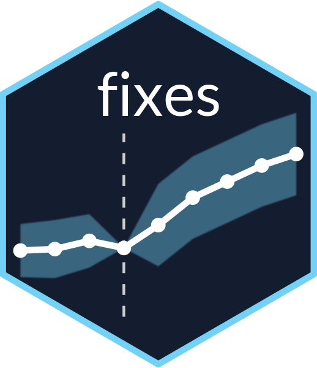

<!-- README.md is generated from README.Rmd. Please edit that file -->

# fixes <a></a>


<!-- badges: start -->
```{r, include=FALSE}
rcompendium::add_cran_badge(quiet = FALSE)
```
[](https://CRAN.R-project.org/package=fixes)
[](https://github.com/yo5uke/fixes/actions/workflows/R-CMD-check.yaml)
<!-- badges: end -->

## Overview

> **Current version:** 0.7.0

> **Note**
> By default, the `fixes` package assumes time is a regularly spaced numeric variable (e.g., year = 1995, 1996, ...).
> If your time variable is irregular or non-numeric (e.g., `Date` type), set `time_transform = TRUE` to automatically convert it to a sequential index within each unit.
> For unit-specific treatment timing, set `staggered = TRUE`.

The `fixes` package is designed for convenient event study analysis and plotting, particularly useful for visualizing parallel trends and dynamic effects in two-way fixed effects (TWFE) difference-in-differences (DID) research.

**Key Functions:**

1. `run_es()` — Takes a data frame, generates lead/lag dummies, and fits the event study regression. Supports fixed effects, covariates, clustering, staggered timing, weights, custom baseline, and multiple confidence intervals. By default, calculates 90%, 95%, and 99% confidence intervals for flexible visualization.
2. `plot_es()` — Plots event study results using `ggplot2` with flexible options: ribbon or error bars, choice of CI level, and theme customization.
3. `plot_es_interactive()` — Creates interactive plotly visualizations with dynamic confidence interval switching, hover tooltips, zoom/pan functionality, and more. **New in version 0.7.0!**

## Installation

Install from CRAN:

```r
install.packages("fixes")
```

Or with **pak**:

```r
pak::pak("fixes")
```

For the latest development version from GitHub:

```r
pak::pak("yo5uke/fixes")
```

## How to use

First, load the library.

```r
library(fixes)
```

### Data frame requirements

`run_es()` expects a panel data frame with at least:

- Unit identifier (e.g., individual, firm, region)
- Treatment indicator (0/1 or TRUE/FALSE)
- Time variable (numeric or `Date`)
- Outcome variable (continuous)

For **staggered adoption** (`staggered = TRUE`), include a variable specifying unit-specific treatment timing (e.g., "treatment_year").

#### Example data

Widely used panel datasets include:

- `did::sim_dt()`: simulated panel for DiD tutorials
- `fixest::base_stagg`: a built-in dataset for staggered adoption

```{r}
df1 <- fixest::base_did      # Basic DiD
df2 <- fixest::base_stagg    # Staggered treatment
```

```{r, echo=FALSE}
head(df1) |>
  knitr::kable()
head(df2) |>
  knitr::kable()
```

### `run_es()`

The main event study function. All key arguments below:

| Argument        | Description |
|-----------------|-------------|
| `data`          | Data frame to be used. |
| `outcome`       | Outcome variable. Can be specified as a raw variable or a transformation (e.g., `log(y)`). Provide it unquoted. |
| `treatment`     | Dummy variable indicating the treated units. Provide it unquoted. Accepts both `0/1` and `TRUE/FALSE`. |
| `time`          | Time variable. Provide it unquoted. |
| `timing`        | The time at which the treatment occurs. If `staggered = FALSE`, this should be a scalar (e.g., `2005`). If `staggered = TRUE`, provide a variable (column) indicating the treatment time for each unit. |
| `fe`            | Fixed effects to control for unobserved heterogeneity. **Must be a one-sided formula** (e.g., `~ id + year`). |
| `lead_range`    | Number of pre-treatment periods to include (e.g., 3 = `lead3`, `lead2`, `lead1`). Default is `NULL`, which automatically uses the maximum available lead range. |
| `lag_range`     | Number of post-treatment periods to include (e.g., 2 = `lag0` (the treatment period), `lag1`, `lag2`). Default is `NULL`, which automatically uses the maximum available lag range. |
| `covariates`    | Additional covariates to include in the regression. **Must be a one-sided formula** (e.g., `~ x1 + x2`). |
| `cluster`       | Specifies clustering for standard errors. Can be a **character vector** (e.g., `c("id", "year")`) or a **formula** (e.g., `~ id + year`, `~ id^year`). |
| `weights`       | Optional weights to be used in the regression. Provide as a one-sided formula (e.g., `~ weight`). |
| `baseline`      | Relative time value to be used as the reference category. The corresponding dummy is excluded from the regression. **Must be within the specified lead/lag range.** |
| `interval`      | Time interval between observations (e.g., `1` for yearly data, `5` for 5-year intervals). |
| `time_transform`| Logical. If `TRUE`, converts the `time` variable into a sequential index (1, 2, 3, ...) within each unit. Useful for irregular time (e.g., Date). Default is `FALSE`. |
| `unit`          | Required if `time_transform = TRUE`. Specifies the panel unit identifier (e.g., `firm_id`). |
| `staggered`     | Logical. If `TRUE`, allows for unit-specific treatment timing (staggered adoption). Default is `FALSE`. |
| `conf.level`    | Numeric vector of confidence levels (default: `c(0.90, 0.95, 0.99)`). Specify a single value like `0.95` if only one CI level is needed. |

#### Example: basic event study

```r
event_study <- run_es(
  data       = df1,
  outcome    = y,
  treatment  = treat,
  time       = period,
  timing     = 6,
  fe         = ~ id + period,
  lead_range = 5,
  lag_range  = 4,
  cluster    = ~ id,
  baseline   = -1,
  interval   = 1,
  conf.level = c(0.90, 0.95, 0.99)
)
```

- `fe` must be a one-sided formula (e.g., `~ firm_id + year`).
- `cluster` can be a one-sided formula or a character vector.

#### With covariates

```r
event_study <- run_es(
  data       = df1,
  outcome    = y,
  treatment  = treat,
  time       = period,
  timing     = 6,
  fe         = ~ id + period,
  lead_range = 5,
  lag_range  = 4,
  covariates = ~ cov1 + cov2 + cov3,
  cluster    = ~ id,
  baseline   = -1,
  interval   = 1
)
```

#### Using irregular time data (`Date`), with `time_transform`

```r
df_alt <- df1 |>
  dplyr::mutate(
    year = rep(2001:2010, times = 108),
    date = as.Date(paste0(year, "-01-01"))
  )

event_study_alt <- run_es(
  data           = df_alt,
  outcome        = y,
  treatment      = treat,
  time           = date,
  timing         = 9,  # Use index, not the original Date
  fe             = ~ id + period,
  lead_range     = 3,
  lag_range      = 3,
  cluster        = ~ id,
  baseline       = -1,
  time_transform = TRUE,
  unit           = id
)
```

> **Note:**  
> When `time_transform = TRUE`, specify `timing` as an index (e.g., 9 = 9th observation in unit).  
> Currently, `time_transform = TRUE` *cannot* be combined with `staggered = TRUE` (future versions may support this).

### `plot_es()`

`plot_es()` visualizes results using `ggplot2`. By default, it plots a ribbon for the 95% CI, but supports error bars, CI level selection, and multiple themes.

| Argument     | Description                                |
|--------------|--------------------------------------------|
| data         | Data frame from `run_es()`                 |
| ci_level     | Confidence interval (default: 0.95)        |
| type         | "ribbon" (default) or "errorbar"           |
| vline_val    | X for vertical line (default: 0)           |
| vline_color  | Color for vline (default: "#000")          |
| hline_val    | Y for horizontal line (default: 0)         |
| hline_color  | Color for hline (default: "#000")          |
| linewidth    | Line width (default: 1)                    |
| pointsize    | Point size (default: 2)                    |
| alpha        | Ribbon transparency (default: 0.2)         |
| barwidth     | Errorbar width (default: 0.2)              |
| color        | Point/line color (default: "#B25D91FF")    |
| fill         | Ribbon color (default: "#B25D91FF")        |
| theme_style  | Theme: "bw" (default), "minimal", "classic"|

#### Example usage

```r
plot_es(event_study)
plot_es(event_study, type = "errorbar")
plot_es(event_study, type = "ribbon", ci_level = 0.9, theme_style = "minimal")
plot_es(event_study, type = "errorbar", ci_level = 0.99) + ggplot2::ggtitle("Event Study, 99% CI")
```

Further customization with `ggplot2` is fully supported:

```r
plot_es(event_study, type = "errorbar") +
  ggplot2::scale_x_continuous(breaks = seq(-5, 5, by = 1)) +
  ggplot2::ggtitle("Result of Event Study")
```

### `plot_es_interactive()` — Interactive Plotting

**New in version 0.7.0!** Create interactive plotly visualizations with dynamic confidence interval switching.

> **Note:**
> The `plotly` package is required for interactive plots. Install with `install.packages("plotly")`.

#### Key Features

- **Dynamic CI Switching**: Toggle between 90%, 95%, and 99% confidence intervals using interactive buttons
- **Hover Tooltips**: View detailed information (estimate, CI bounds, p-value, sample size) by hovering over points
- **Zoom and Pan**: Built-in plotly interactivity for exploring your results
- **Flexible Display**: Choose between ribbon or errorbar styles

#### Multiple Confidence Intervals

By default, `run_es()` now calculates 90%, 95%, and 99% confidence intervals simultaneously with no performance penalty (calculations are vectorized). This enables interactive CI switching without re-running the estimation.

```r
# Default behavior: multiple CIs calculated automatically
event_study <- run_es(
  data       = df1,
  outcome    = y,
  treatment  = treat,
  time       = period,
  timing     = 6,
  fe         = ~ id + period,
  cluster    = ~ id
)

# The print method informs you about available CI levels
print(event_study)
#> Event Study Result (fixes)
#>   N: 1080  | Units: NA  | Treated units: 540  | Never-treated: NA
#>   FE: id + period
#>   VCOV: HC1  | Cluster: id
#>   Method: classic  | lead_range: 5  lag_range: 4  baseline: -1
#>   Note: Multiple confidence levels calculated (90%, 95%, 99%).
#>         Use plot_es_interactive() for dynamic CI switching.
```

#### Basic Interactive Plot

```r
# Create interactive plot with default settings (starts with 95% CI)
plot_es_interactive(event_study)
```

This creates an interactive plot with:
- Buttons to switch between 90%, 95%, and 99% CIs
- Hover tooltips showing detailed information
- Zoom and pan functionality
- Legend toggle

#### Customization Options

```r
# Start with 90% CI
plot_es_interactive(event_study, conf.level = 0.90)

# Use errorbar display style
plot_es_interactive(event_study, display_type = "errorbar")

# Apply different theme
plot_es_interactive(event_study, theme = "minimal")

# Full customization
plot_es_interactive(
  event_study,
  conf.level = 0.95,
  display_type = "ribbon",
  theme = "bw",
  color = "#E64B35",
  fill = "#E64B35",
  alpha = 0.3
)
```

| Argument       | Description                                      |
|----------------|--------------------------------------------------|
| data           | es_result object from `run_es()`                 |
| conf.level     | Initial CI level to display (default: 0.95)      |
| display_type   | "ribbon" (default) or "errorbar"                 |
| theme          | "bw" (default), "minimal", or "classic"          |
| color          | Line and point color (default: "#B25D91FF")      |
| fill           | Ribbon fill color (default: "#B25D91FF")         |
| alpha          | Ribbon transparency (default: 0.2)               |
| linewidth      | Line width (default: 1)                          |
| pointsize      | Point size (default: 2)                          |

#### Backward Compatibility

For users who prefer single CI calculations (e.g., for publications with only 95% CIs), simply specify `conf.level = 0.95`:

```r
event_study_single <- run_es(
  data       = df1,
  outcome    = y,
  treatment  = treat,
  time       = period,
  timing     = 6,
  fe         = ~ id + period,
  conf.level = 0.95  # Calculate only 95% CI
)

# Static plot works exactly as before
plot_es(event_study_single)
```

## Planned Features

- Support for `staggered = TRUE` with `time_transform = TRUE`
- Allow `timing` to accept original time values (e.g., `Date`), not just index

## Debugging and Contributions

If you find an issue or want to contribute, please use the [GitHub Issues page](https://github.com/yo5uke/fixes/issues).

---

Happy analyzing!🥂
