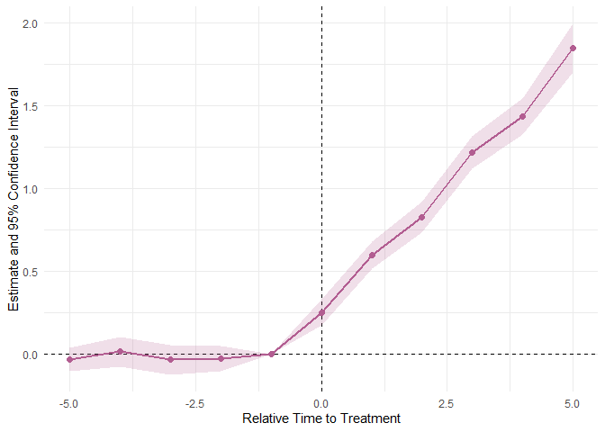
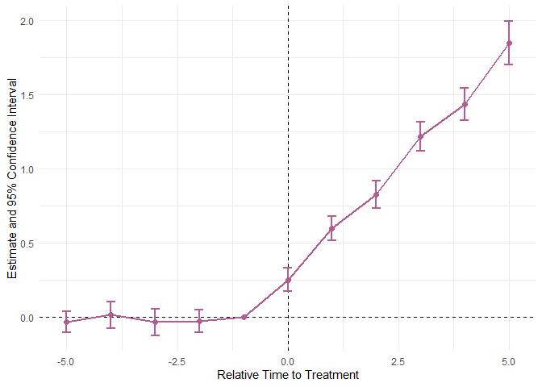
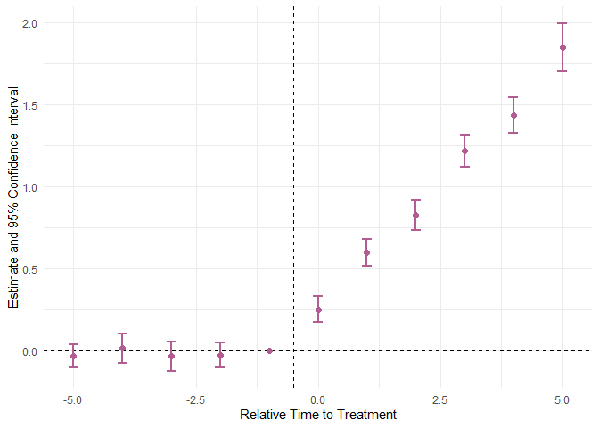
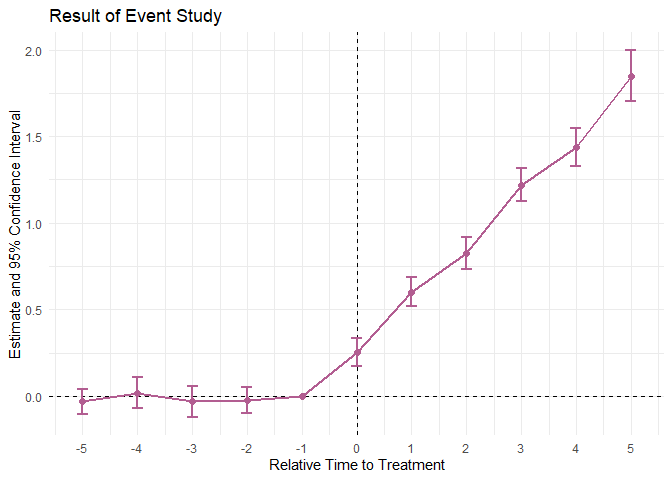

<!-- README.md is generated from README.qmd. Please edit that file -->

# fixes <a></a>

<!-- badges: start -->

[](https://github.com/yo5uke/fixes/actions/workflows/R-CMD-check.yaml)
<!-- badges: end -->

## Overview

> **Note**  
> The `fixes` package currently supports data with annual time intervals
> only.  
> For datasets with finer time intervals, such as monthly or quarterly
> data, I recommend creating a new column with sequential time numbers
> (e.g., 1, 2, 3, …) representing the time order.  
> This column can then be used for analysis.

The `fixes` package is designed for conducting analysis and creating
plots for event studies, a method used to verify the parallel trends
assumption in two-way fixed effects (TWFE) difference-in-differences
(DID) analysis.

The package includes two main functions:

1.  `run_es()`: Accepts a data frame, generates lead and lag variables,
    and performs event study analysis. The function returns the results
    as a data frame.
2.  `plot_es()`: Creates plots using `ggplot2` based on the data frame
    generated by `run_es()`. Users can choose between a plot with
    `geom_ribbon()` or `geom_errorbar()` to visualize the results.

## Installation

You can install the package like so:

``` r
# install.packages("pak")
pak::pak("yo5uke/fixes")
```

or

``` r
# install.packages("devtools")
devtools::install_github("yo5uke/fixes")
```

The `fixes` package is not currently available on CRAN. Please install
it from the GitHub repository.

## How to use

First, load the library.

``` r
library(fixes)
```

### Data frame

The data frame to be analyzed must include the following variables:

1.  A variable to identify individuals.
2.  A dummy variable indicating treated individuals (e.g.,
    `is_treated`).
3.  A variable representing time (e.g., `year`).
4.  An outcome variable.

For example, a data frame like the following:

| firm_id | state_id | year | is_treated |          y |
|--------:|---------:|-----:|-----------:|-----------:|
|       1 |       21 | 1980 |          1 |  0.8342158 |
|       1 |       21 | 1981 |          1 | -0.5354355 |
|       1 |       21 | 1982 |          1 |  1.1372828 |
|       1 |       21 | 1983 |          1 |  0.7339165 |
|       1 |       21 | 1984 |          1 |  1.4232840 |
|       1 |       21 | 1985 |          1 |  1.2783362 |

### `run_es()`

`run_es()` has nine arguments.

| Arguments | Description |
|----|----|
| data | Data frame to be used |
| outcome | Outcome variable |
| treatment | Dummy variable indicating the individual being treated |
| time | Variable that represents time |
| timing | Variable indicating treatment timing |
| lead_range | Range of time before treatment |
| lag_range | Range of time aftere treatment (excluding the year of treatment) |
| fe | Variable representing fixed effects |
| cluster | A variable that specifies how to cluster the standard error (if clustering is requested) |
| baseline | A number indicating the relative year to be dropped when performing a regression |
| interval | Parameter to specify the time step between observations (e.g., 1 for yearly data, 5 for 5-year intervals) |

Then, perform the analysis as follows:

``` r
event_study <- run_es(
  data       = df, 
  outcome    = y, 
  treatment  = is_treated, 
  time       = year, 
  timing     = 1998, 
  lead_range = 5, 
  lag_range  = 5, 
  fe         = firm_id + year, 
  cluster    = "state_id", 
  baseline   = -1, 
  interval   = 1
)
```

***Note:*** Please enclose `fe` and `cluster` in double quotation marks.

By executing `run_es()`, the event study analysis results will be
returned as a tidy data frame[^1].

You can use this data to create your own plots, but `fixes` also has
convenient plotting functions.

### `plot_es()`

The `plot_es()` function creates a plot based on `ggplot2`.

`plot_es()` has 12 arguments.

| Arguments | Description |
|----|----|
| data | Data frame created by `run_es()` |
| type | The type of confidence interval visualization: “ribbon” (default) or “errorbar” |
| vline_val | The x-intercept for the vertical reference line (default: 0) |
| vline_color | Color for the vertical reference line (default: “\#000”) |
| hline_val | The y-intercept for the horizontal reference line (default: 0) |
| hline_color | Color for the horizontal reference line (default: “\#000”) |
| linewidth | The width of the lines for the plot (default: 1) |
| pointsize | The size of the points for the estimates (default: 2) |
| alpha | The transparency level for ribbons (default: 0.2) |
| barwidth | The width of the error bars (default: 0.2) |
| color | The color for the lines and points (default: “\#B25D91FF”) |
| fill | The fill color for ribbons (default: “\#B25D91FF”). |

If you don’t care about the details, you can just pass the data frame
created with `run_es()` and the plot will be complete.

``` r
plot_es(event_study)
```



``` r
plot_es(event_study, type = "errorbar")
```



``` r
plot_es(event_study, type = "errorbar", vline_val = -.5)
```



Since it is created on a `ggplot2` basis, it is possible to modify minor
details.

``` r
plot_es(event_study, type = "errorbar") + 
  ggplot2::scale_x_continuous(breaks = seq(-5, 5, by = 1)) + 
  ggplot2::ggtitle("Result of Event Study")
```



## Debugging

If you find an issue, please report it on the GitHub Issues page.

[^1]: Behind the scenes of the analysis, fixest::feols() is used.
