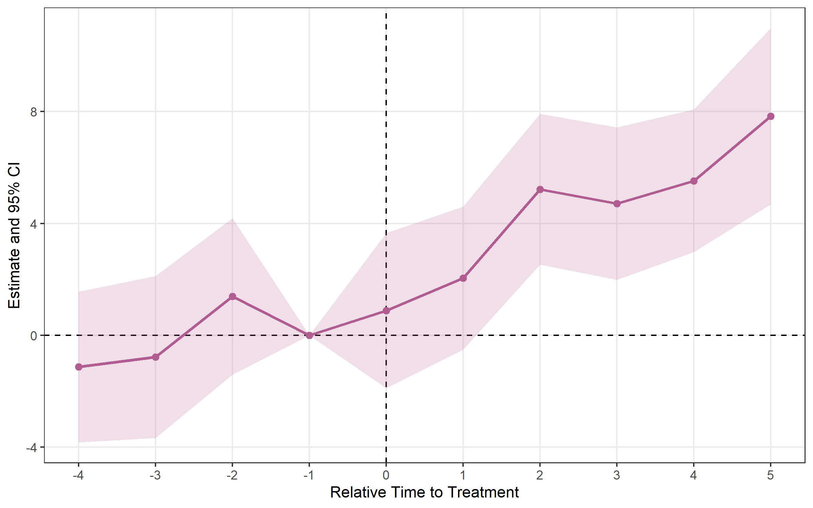
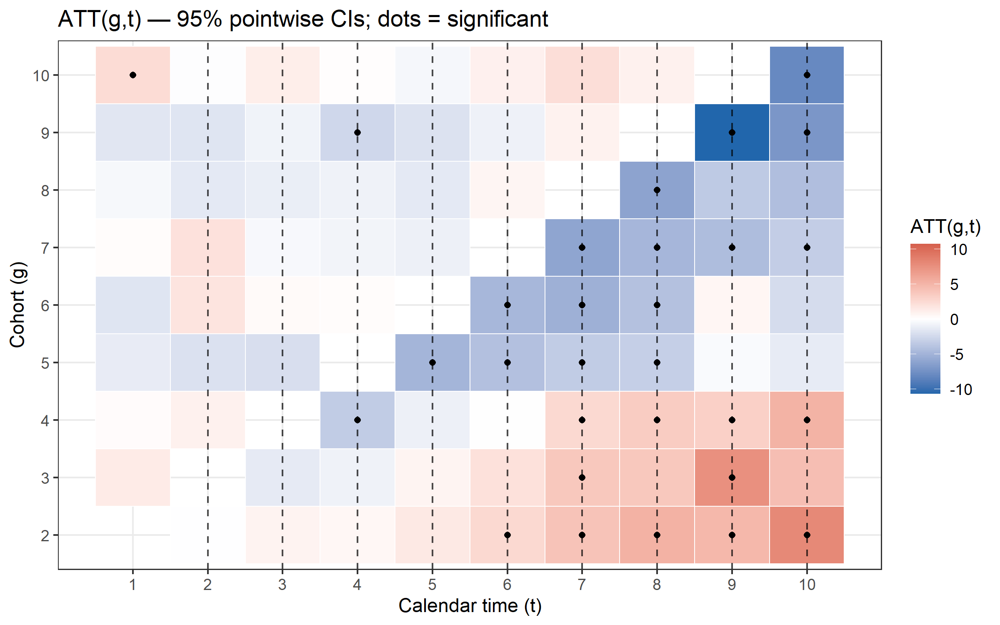
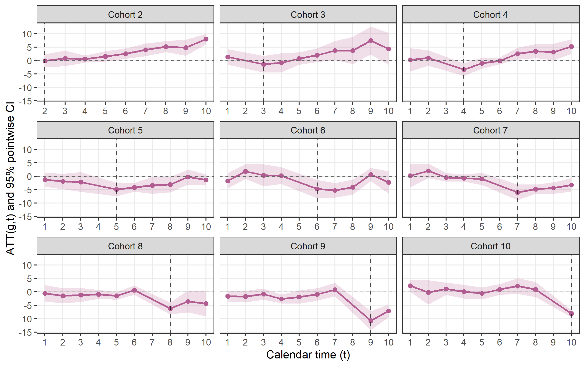
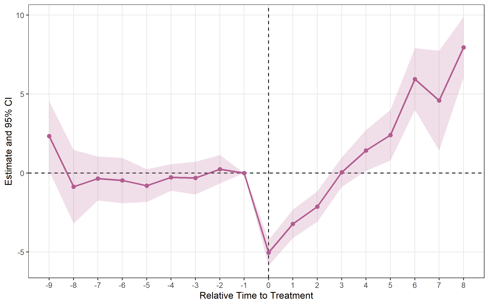
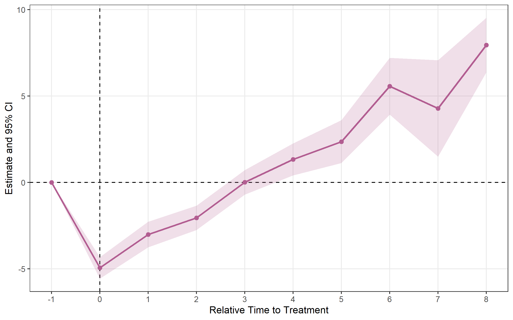
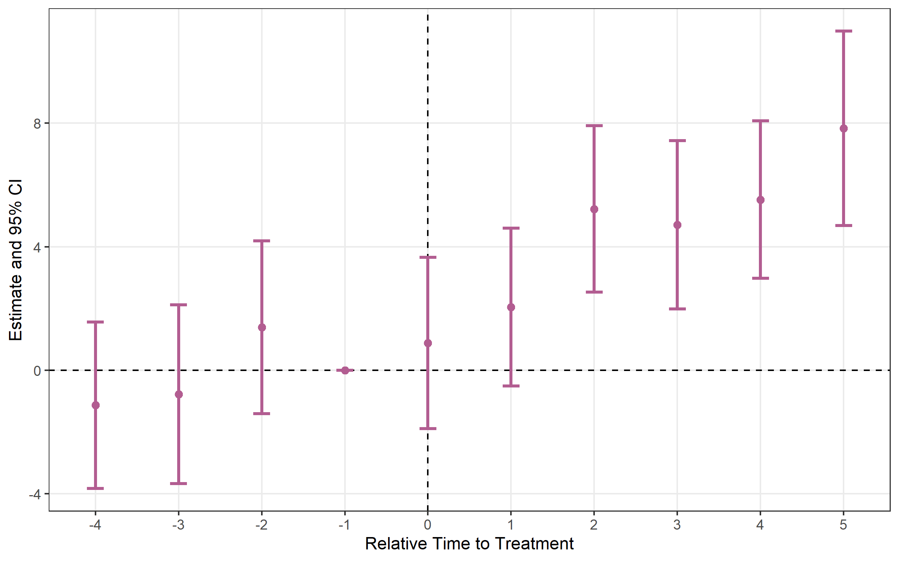
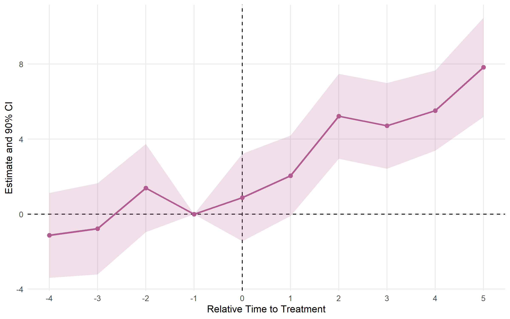

<!-- README.md is generated from README.Rmd. Please edit that file -->


# fixes <a></a>

<!-- badges: start -->
[](https://CRAN.R-project.org/package=fixes)
[](https://github.com/yo5uke/fixes/actions/workflows/R-CMD-check.yaml)
<!-- badges: end -->

## Overview

`fixes` is an R package for **event study analysis** in panel data — the workhorse tool for visualizing parallel trends and dynamic treatment effects in difference-in-differences research.

Version 0.8.0 adds three modern estimators designed for **staggered adoption** (where different units adopt treatment at different times), all accessible through the same `run_es()` interface.

**Key functions:**

| Function | What it does |
|---|---|
| `run_es()` | Estimate an event study (4 estimators available) |
| `plot_es()` | Static ggplot2 event study plot |
| `plot_att_gt()` | Visualize the full ATT(g,t) matrix (CS estimator) |
| `plot_es_interactive()` | Interactive plotly plot with hover tooltips |

**Estimators** (selected via the `estimator` argument in `run_es()`):

| `estimator` | Reference | Best for |
|---|---|---|
| `"twfe"` | Classic TWFE | Universal treatment timing |
| `"cs"` | Callaway & Sant'Anna (2021) | Staggered adoption |
| `"sa"` | Sun & Abraham (2021) | Staggered adoption |
| `"bjs"` | Borusyak, Jaravel & Spiess (2024) | Staggered adoption |

## Installation

```r
# From CRAN
install.packages("fixes")

# Development version
pak::pak("yo5uke/fixes")
```

## Quick start


``` r
library(fixes)
```

---

## Classic event study (single treatment date)

Use `run_es()` with a fixed event date. Here we use `fixest::base_did`, a
simulated balanced panel where all units are treated at period 5.


``` r
df <- fixest::base_did

es <- run_es(
  data      = df,
  outcome   = y,          # outcome variable (unquoted)
  treatment = treat,      # 0/1 treatment indicator
  time      = period,     # time variable
  timing    = 5,          # treatment occurs at period 5
  fe        = ~ id + period,
  cluster   = ~ id,
  baseline  = -1          # period -1 is the reference (default)
)

print(es)
```

```
## Event Study Result (fixes)
##   N: 1080  | Units: NA  | Treated units: 1080  | Never-treated: NA 
##   FE: id + period
##   VCOV: HC1  | Cluster: id 
##   Method: classic  | lead_range: 4  lag_range: 5  baseline: -1
```


``` r
plot_es(es)
```



---

## Staggered adoption

When units adopt treatment at different times, the classic TWFE estimator can
be biased. `fixes` provides three modern alternatives.

**Setup:** create a shared dataset from `fixest::base_stagg`.
Never-treated units use `NA` for their timing column — this is the convention
for all three staggered estimators.


``` r
df_stagg <- fixest::base_stagg
df_stagg$timing <- df_stagg$year_treated
df_stagg$timing[df_stagg$year_treated == 10000] <- NA  # mark never-treated
```

### Callaway & Sant'Anna (2021) — `estimator = "cs"`

Estimates a separate ATT(g,t) for every combination of cohort g and calendar
time t, then aggregates to the event-study curve. Comparison group can be
never-treated units (default) or not-yet-treated units.


``` r
cs <- run_es(
  data          = df_stagg,
  outcome       = y,
  time          = year,
  timing        = timing,   # first treatment period; NA = never treated
  unit          = id,
  staggered     = TRUE,
  estimator     = "cs",
  control_group = "nevertreated"   # or "notyettreated"
)

print(cs)
```

```
## Event Study Result (fixes)
##   N: 950  | Units: 95  | Treated units: 45  | Never-treated: 50 
##   FE: 
##   VCOV: analytic  | Cluster: - 
##   Method: classic  | lead_range: 9  lag_range: 8  baseline: -1
```


``` r
plot_es(cs)
```


#### Visualise the full ATT(g,t) matrix

`plot_att_gt()` shows every cohort × calendar-time cell, making it easy to
spot anticipation effects or heterogeneous dynamics.


``` r
plot_att_gt(cs, type = "heatmap")
```




``` r
plot_att_gt(cs, type = "facet")
```



---

### Sun & Abraham (2021) — `estimator = "sa"`

Builds cohort × horizon interaction terms, then aggregates with cohort-share
weights. Gives the same result as `fixest::sunab()` but through the unified
`run_es()` interface.


``` r
sa <- run_es(
  data      = df_stagg,
  outcome   = y,
  treatment = treated,
  time      = year,
  timing    = timing,
  unit      = id,
  fe        = ~ id + year,
  staggered = TRUE,
  estimator = "sa",
  cluster   = ~ id
)

print(sa)
```

```
## Event Study Result (fixes)
##   N: 950  | Units: 95  | Treated units: 45  | Never-treated: 50 
##   FE: id + year
##   VCOV: HC1  | Cluster: id 
##   Method: classic  | lead_range: 9  lag_range: 8  baseline: -1
```


``` r
plot_es(sa)
```



---

### Borusyak, Jaravel & Spiess (2024) — `estimator = "bjs"`

A three-step imputation approach:

1. Fit a TWFE model on **untreated** observations only (never-treated + not-yet-treated).
2. Impute each treated unit's counterfactual outcome.
3. Average the imputed treatment effects by event-study horizon.


``` r
bjs <- run_es(
  data      = df_stagg,
  outcome   = y,
  time      = year,
  timing    = timing,
  unit      = id,
  staggered = TRUE,
  estimator = "bjs"
)

print(bjs)
```

```
## Event Study Result (fixes)
##   N: 950  | Units: 95  | Treated units: 45  | Never-treated: 50 
##   FE: id + year
##   VCOV: bjs_conservative  | Cluster: - 
##   Method: classic  | lead_range: 1  lag_range: 8  baseline: -1
```


``` r
plot_es(bjs)
```



---

## Plotting options

`plot_es()` works with results from any estimator.


``` r
# Error bars instead of ribbon
plot_es(es, type = "errorbar")
```




``` r
# Multiple CI levels at once
es_multi <- run_es(
  data      = df,
  outcome   = y,
  treatment = treat,
  time      = period,
  timing    = 5,
  fe        = ~ id + period,
  cluster   = ~ id,
  conf.level = c(0.90, 0.95, 0.99)
)
plot_es(es_multi, ci_level = 0.90, theme_style = "minimal")
```



### Interactive plots

`plot_es_interactive()` produces a plotly chart with hover tooltips (requires
the `plotly` package).


``` r
plot_es_interactive(es)
```

---

## Key `run_es()` arguments

| Argument | Default | Description |
|---|---|---|
| `data` | — | Panel data frame |
| `outcome` | — | Outcome variable (unquoted) |
| `treatment` | `NULL` | 0/1 treatment dummy (`"twfe"` only) |
| `time` | — | Time variable (numeric) |
| `timing` | — | Treatment date (scalar for `"twfe"`, column for others; `NA` = never treated) |
| `unit` | `NULL` | Unit ID column (required for `"cs"`, `"sa"`, `"bjs"`) |
| `fe` | `NULL` | Fixed effects formula, e.g. `~ id + year` |
| `estimator` | `"twfe"` | `"twfe"`, `"cs"`, `"sa"`, or `"bjs"` |
| `staggered` | `FALSE` | Set `TRUE` for unit-varying treatment timing |
| `control_group` | `"nevertreated"` | CS only: `"nevertreated"` or `"notyettreated"` |
| `cluster` | `NULL` | Clustering formula, e.g. `~ id` |
| `baseline` | `-1` | Reference period (0 = treatment date) |
| `lead_range` | auto | Pre-treatment periods to show |
| `lag_range` | auto | Post-treatment periods to show |
| `conf.level` | `0.95` | CI level(s); vector allowed, e.g. `c(0.90, 0.95)` |
| `vcov` | `"HC1"` | VCOV type (any `fixest::vcov()` type) |

---

## Contributing

Found a bug or have a feature request? Open an issue on
[GitHub](https://github.com/yo5uke/fixes/issues).
