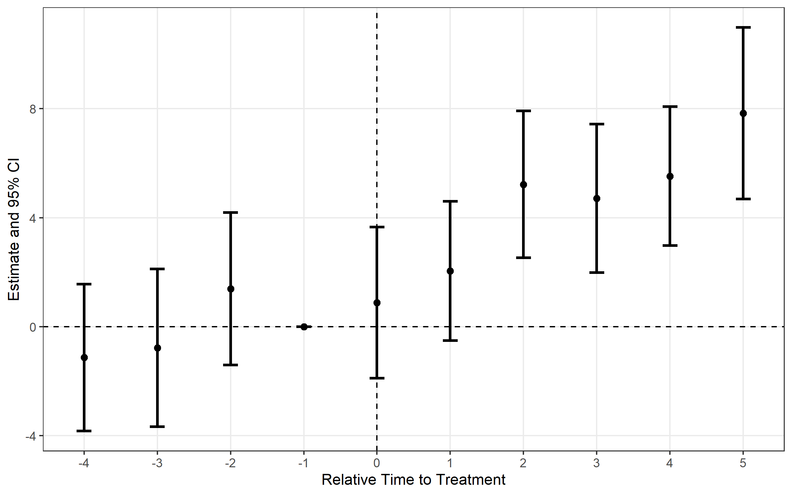
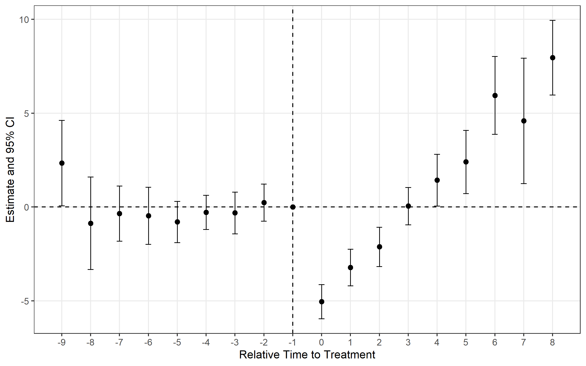
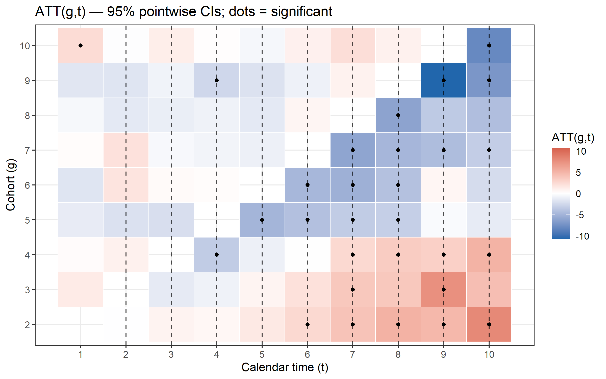
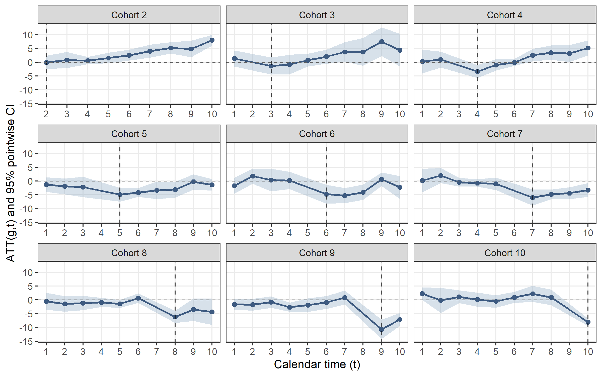
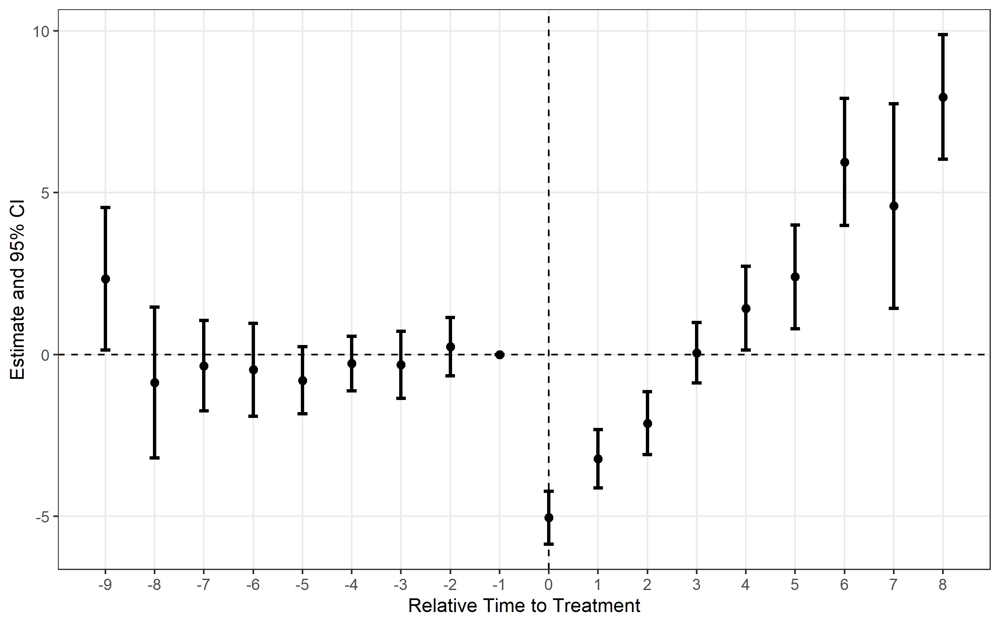
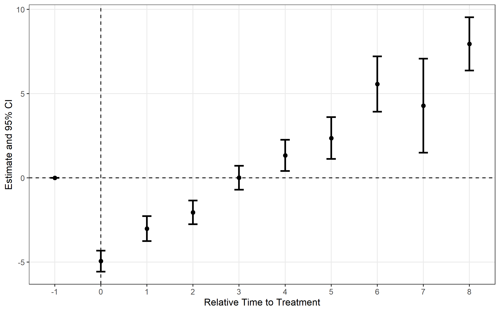
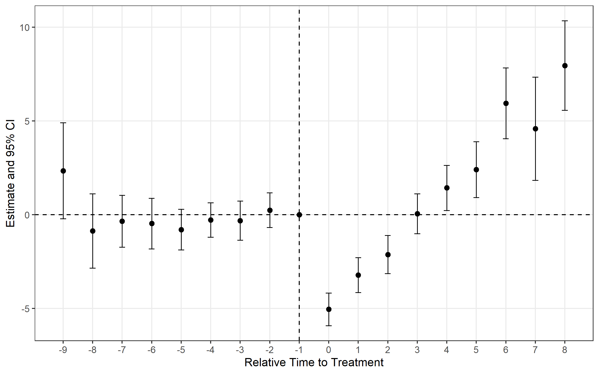
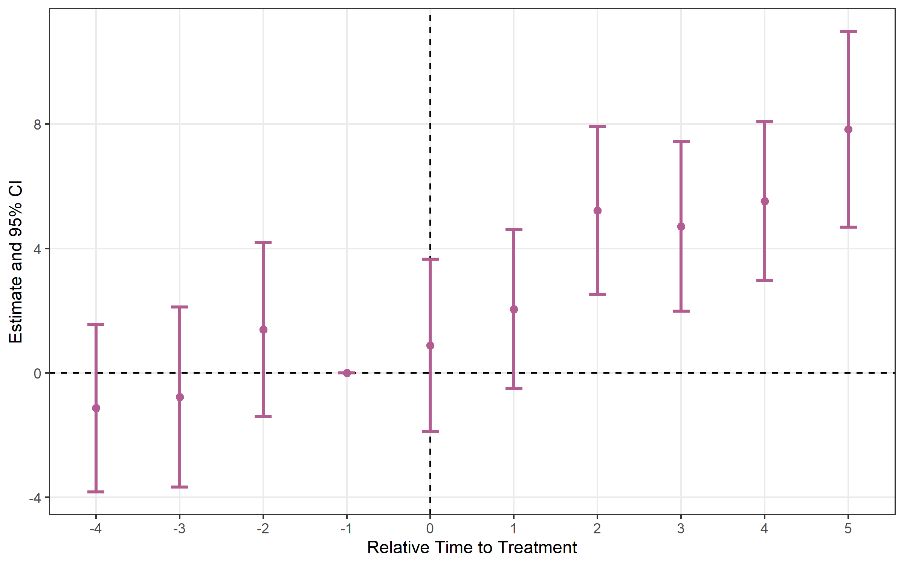
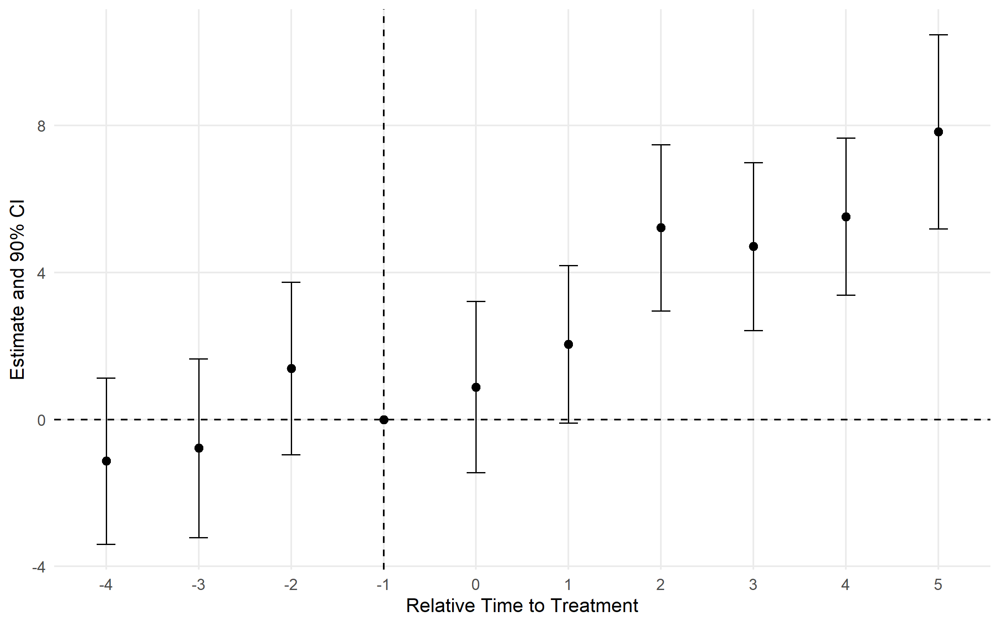

<!-- README.md is generated from README.Rmd. Please edit that file -->

# fixes <a></a>

<!-- badges: start -->

[](https://CRAN.R-project.org/package=fixes)
[](https://github.com/yo5uke/fixes/actions/workflows/R-CMD-check.yaml)
<!-- badges: end -->

## Overview

`fixes` is an R package for **difference-in-differences estimation** in
panel data. It covers the three stages of a modern DiD workflow:

| Stage | Function | What it does |
|----|----|----|
| 1\. Event study | `event_study()` | Dynamic treatment effects by relative time (6 estimators) |
| 2\. ATT aggregation | `att()` | Aggregated ATT — overall, by cohort, by calendar time |
| 3\. Basic DiD | `did()` | Single-coefficient TWFE DiD with `modelsummary` support |
| 4\. Sensitivity | `honest_sensitivity()` | Robust inference under violations of parallel trends (Rambachan & Roth 2023) |
| Visualisation | `plot()` | Every result has a base `plot()` method (ggplot2); `plot(x, interactive = TRUE)` gives a plotly chart, `plot(att_gt(x))` the ATT(g,t) heatmap/facets |

Estimation runs on the package’s internal C++ fixed-effects OLS engine —
`fixest` is an optional (suggested) dependency, not a requirement.

> **Upgrading from \< 1.0.0?** The verb-style API (`run_es()`,
> `calc_att()`, `run_did()`, `plot_es()`, …) still works and returns
> identical results, but is deprecated. See `NEWS.md` for the old-to-new
> mapping.

**Estimators** (selected via the `estimator` argument in `event_study()`
and `att()`):

| `estimator` | Reference | Best for |
|----|----|----|
| `"twfe"` | Classic TWFE | Universal treatment timing |
| `"cs"` | Callaway & Sant’Anna (2021) | Staggered adoption |
| `"sa"` | Sun & Abraham (2021) | Staggered adoption |
| `"bjs"` | Borusyak, Jaravel & Spiess (2024) | Staggered adoption |
| `"twm"` | Wooldridge (2025) | Staggered adoption; optional cohort trends |
| `"flex"` | Deb, Norton, Wooldridge & Zabel (2024) | Repeated cross-section data |

## Installation

``` r
# From CRAN
install.packages("fixes")

# Development version
pak::pak("yo5uke/fixes")
```

## Quick start

``` r
library(fixes)
```

------------------------------------------------------------------------

## Basic DiD — `did()`

For a simple two-way FE DiD with a single treatment coefficient, use
`did()`. Output is fully compatible with `modelsummary::modelsummary()`
and `tinytable::tt()`.

There are two equivalent ways to specify the treatment:

``` r
# Option A: supply a pre-built D_it indicator
df$D <- as.integer(df$treated & df$year >= 2006)
res <- did(df, outcome = y, treatment = D, fe = ~ id + year)
```

``` r
# Option B: let did() construct D_it from group indicator + timing
res <- did(df, outcome = y, treatment = treated,
               time = year, timing = 2006,
               fe = ~ id + year)
```

Both options produce a `did_result` object:

``` r
df <- fixest::base_did

# Build a universal-timing DiD dataset
df$D <- as.integer(df$treat == 1 & df$period >= 5)

res <- did(
  data    = df,
  outcome = y,
  treatment = D,
  fe      = ~ id + period,
  cluster = ~ id
)

print(res)
```

    ## DiD Estimation  [TWFE]
    ## N = 1080 obs | 330 treated obs
    ## FE: id + period 
    ## VCOV: cluster | Cluster: id 
    ## 
    ##   term estimate std.error statistic  p.value
    ## 1    D      4.5     0.544      8.27 3.94e-13

`did()` integrates with the `broom` and `modelsummary` ecosystems:

``` r
broom::tidy(res)          # all coefficients (treatment + any covariates)
broom::glance(res)        # nobs, within R², AIC, ...
modelsummary::modelsummary(res)   # regression table via tinytable
```

------------------------------------------------------------------------

## Event study — `event_study()`

All six estimators share the same interface.

### Classic TWFE (single treatment date)

Use `event_study()` with a fixed event date. Here we use
`fixest::base_did`, a balanced panel where all units are treated at
period 5.

``` r
es <- event_study(
  data      = df,
  outcome   = y,
  treatment = treat,
  time      = period,
  timing    = 5,
  fe        = ~ id + period,
  cluster   = ~ id,
  baseline  = -1
)

print(es)
```

    ## Event Study Result (fixes)
    ##   N: 1080  | Units: NA  | Treated units: 1080  | Never-treated: NA 
    ##   FE: id + period
    ##   VCOV: cluster  | Cluster: id 
    ##   Estimator: twfe 
    ##   Method: classic  | lead_range: 4  lag_range: 5  baseline: -1

``` r
plot(es)
```

<!-- -->

------------------------------------------------------------------------

### Staggered adoption

When units adopt treatment at different times, the classic TWFE
estimator can be biased. `fixes` provides modern alternatives.

**Setup:** `fixest::base_stagg` — never-treated units have `NA` timing.

``` r
df_stagg <- fixest::base_stagg
df_stagg$timing <- df_stagg$year_treated
df_stagg$timing[df_stagg$year_treated == 10000] <- NA
```

#### Callaway & Sant’Anna (2021) — `estimator = "cs"`

``` r
cs <- event_study(
  data          = df_stagg,
  outcome       = y,
  time          = year,
  timing        = timing,
  unit          = id,
  staggered     = TRUE,
  estimator     = "cs",
  control_group = "nevertreated"
)

print(cs)
```

    ## Event Study Result (fixes)
    ##   N: 950  | Units: 95  | Treated units: 45  | Never-treated: 50 
    ##   FE: 
    ##   VCOV: analytic  | Cluster: - 
    ##   Estimator: cs 
    ##   Method: classic  | lead_range: 9  lag_range: 8  baseline: -1

``` r
plot(cs)
```

<!-- -->

#### Visualise the full ATT(g,t) matrix

``` r
plot(att_gt(cs), type = "heatmap")
```

<!-- -->

``` r
plot(att_gt(cs), type = "facet")
```

<!-- -->

------------------------------------------------------------------------

#### Sun & Abraham (2021) — `estimator = "sa"`

``` r
sa <- event_study(
  data      = df_stagg,
  outcome   = y,
  treatment = treated,
  time      = year,
  timing    = timing,
  unit      = id,
  fe        = ~ id + year,
  staggered = TRUE,
  estimator = "sa",
  cluster   = ~ id
)

print(sa)
```

    ## Event Study Result (fixes)
    ##   N: 950  | Units: 95  | Treated units: 45  | Never-treated: 50 
    ##   FE: id + year
    ##   VCOV: HC1  | Cluster: id 
    ##   Estimator: sa 
    ##   Method: classic  | lead_range: 9  lag_range: 8  baseline: -1

``` r
plot(sa)
```

<!-- -->

------------------------------------------------------------------------

#### Borusyak, Jaravel & Spiess (2024) — `estimator = "bjs"`

``` r
bjs <- event_study(
  data      = df_stagg,
  outcome   = y,
  time      = year,
  timing    = timing,
  unit      = id,
  staggered = TRUE,
  estimator = "bjs"
)

print(bjs)
```

    ## Event Study Result (fixes)
    ##   N: 950  | Units: 95  | Treated units: 45  | Never-treated: 50 
    ##   FE: id + year
    ##   VCOV: bjs_conservative  | Cluster: - 
    ##   Estimator: bjs 
    ##   Method: classic  | lead_range: 1  lag_range: 8  baseline: -1

``` r
plot(bjs)
```

<!-- -->

------------------------------------------------------------------------

#### Wooldridge (2025) Two-Way Mundlak — `estimator = "twm"`

Algebraically equivalent to Sun-Abraham in the base case.
`trends = TRUE` adds cohort-specific linear trend regressors to absorb
differential pre-trends (output shows `relative_time ≥ 0` only).

``` r
twm <- event_study(
  data      = df_stagg,
  outcome   = y,
  time      = year,
  timing    = timing,
  unit      = id,
  fe        = ~ id + year,
  staggered = TRUE,
  estimator = "twm"
)

print(twm)
```

    ## Event Study Result (fixes)
    ##   N: 950  | Units: 95  | Treated units: 45  | Never-treated: 50 
    ##   FE: id + year
    ##   VCOV: HC1  | Cluster: - 
    ##   Estimator: twm 
    ##   Method: classic  | lead_range: 9  lag_range: 8  baseline: -1

``` r
plot(twm)
```

<!-- -->

------------------------------------------------------------------------

#### Deb, Norton, Wooldridge & Zabel (2024) FLEX — `estimator = "flex"`

Designed for **repeated cross-section** data (different individuals each
period). Requires a `group` argument identifying the treatment group
each observation belongs to.

``` r
flex <- event_study(
  data      = df_rcs,
  outcome   = y,
  time      = year,
  timing    = timing,
  group     = group_id,
  staggered = TRUE,
  estimator = "flex"
)

plot(flex)
```

------------------------------------------------------------------------

## ATT aggregation — `att()`

After estimating `event_study()` with a staggered estimator, `att()`
computes a single aggregated ATT — or one per cohort / per calendar
period.

``` r
# Overall ATT
att_simple <- att(
  data        = df_stagg,
  outcome     = y,
  time        = year,
  timing      = timing,
  unit        = id,
  estimator   = "cs",
  aggregation = "simple"
)

print(att_simple)
```

    ## ATT Estimation  [estimator: CS | aggregation: Simple (overall)]
    ## N = 950 obs | 95 units | 45 treated
    ## 
    ##   group estimate std.error statistic  p.value conf_low_95 conf_high_95
    ## 1    NA   -0.755     0.226     -3.35 0.000813        -1.2       -0.313

``` r
# Per-cohort ATT
att(df_stagg, y, year, timing, unit = id,
         estimator = "cs", aggregation = "by_cohort")

# Per-calendar-period ATT
att(df_stagg, y, year, timing, unit = id,
         estimator = "cs", aggregation = "by_time")
```

Supported estimators for `att()`: `"cs"` (Callaway-Sant’Anna 2021) and
`"bjs"` (Borusyak et al. 2024).

------------------------------------------------------------------------

## Bootstrap simultaneous confidence bands

Pointwise CIs control error rates one period at a time. When you plot 15
pre- and post-treatment estimates, the joint false-positive rate may
exceed 5 %. Simultaneous bands (Callaway & Sant’Anna 2021, Corollary 1)
provide joint coverage across the entire event-study curve.

``` r
cs_boot <- event_study(
  data          = df_stagg,
  outcome       = y,
  time          = year,
  timing        = timing,
  unit          = id,
  staggered     = TRUE,
  estimator     = "cs",
  control_group = "nevertreated",
  bootstrap     = TRUE,
  boot_reps     = 999,
  boot_seed     = 42
)
```

``` r
# Lighter outer band = simultaneous CI; darker inner band = pointwise CI
plot(cs_boot, show_simultaneous = TRUE)
```

``` r
plot(cs_boot, interactive = TRUE, show_simultaneous = TRUE)
```

------------------------------------------------------------------------

## Honest sensitivity analysis — `honest_sensitivity()`

Event-study estimates rely on the **parallel trends** assumption. Rather
than testing pre-trends and hoping for the best, `honest_sensitivity()`
implements Rambachan & Roth (2023): it reports confidence sets for a
post-treatment effect under progressively weaker restrictions on how
different post-treatment violations of parallel trends can be from the
pre-trends, plus a *breakdown value* — the largest violation at which
the effect is still significant.

``` r
res <- event_study(df, outcome = y, treatment = treat, time = year, timing = 6,
              fe = ~ id + year)

# Relative-magnitude restriction: post violation <= Mbar x max pre violation
h <- honest_sensitivity(res, type = "relative_magnitude",
                        m_grid = c(0, 0.5, 1, 1.5, 2))
print(h)          # robust CIs per Mbar + the original (parallel-trends) CI
plot(h)    # "top-down" sensitivity plot
```

Use `type = "smoothness"` for the (bounded second difference)
restriction. Inference uses the Andrews-Roth-Pakes conditional test — a
pure-R reimplementation validated against the **HonestDiD** package. For
estimators other than `"twfe"`, pass `betahat` and `sigma` directly. The
numeric helpers (`lpSolveAPI`, `Rglpk`, `TruncatedNormal`, `Matrix`,
`pracma`) are optional `Suggests`.

------------------------------------------------------------------------

## Plotting options

`plot()` works with results from any estimator.

``` r
plot(es, type = "errorbar")
```

<!-- -->

``` r
es_multi <- event_study(
  data      = df,
  outcome   = y,
  treatment = treat,
  time      = period,
  timing    = 5,
  fe        = ~ id + period,
  cluster   = ~ id,
  conf_level = c(0.90, 0.95, 0.99)
)
plot(es_multi, ci_level = 0.90, theme_style = "minimal")
```

<!-- -->

### Interactive plots

``` r
plot(es, interactive = TRUE)
```

------------------------------------------------------------------------

## Key arguments

### `did()`

| Argument | Default | Description |
|----|----|----|
| `data` | — | Data frame (panel) |
| `outcome` | — | Outcome variable (unquoted; expressions like `log(y)` OK) |
| `treatment` | — | Binary D_it indicator, or group dummy when `timing` is set |
| `timing` | `NULL` | Scalar treatment period; auto-constructs `D_it = treatment*(time>=timing)` |
| `fe` | `NULL` | FE formula `~ id + year`; auto-inferred from `unit` + `time` if omitted |
| `unit` | `NULL` | Unit identifier (for FE inference and sample-size metadata) |
| `time` | `NULL` | Time variable (for FE inference and `timing`-based D_it construction) |
| `covariates` | `NULL` | Additional controls, e.g. `~ x1 + x2` |
| `cluster` | `NULL` | Clustering: formula `~ id`, column name, or vector |
| `conf_level` | `0.95` | CI level(s); vector allowed |
| `vcov` | `"HC1"` | VCOV type; cluster-robust SE used automatically when `cluster` is set |

### `event_study()`

| Argument | Default | Description |
|----|----|----|
| `data` | — | Data frame (panel or RCS) |
| `outcome` | — | Outcome variable (unquoted) |
| `treatment` | `NULL` | 0/1 treatment dummy (`"twfe"` only) |
| `time` | — | Time variable (numeric) |
| `timing` | — | Treatment date (scalar for `"twfe"`, column for others; `NA` = never treated) |
| `unit` | `NULL` | Unit ID (required for `"cs"`, `"sa"`, `"bjs"`, `"twm"`) |
| `fe` | `NULL` | Fixed effects formula, e.g. `~ id + year` |
| `estimator` | `"twfe"` | `"twfe"`, `"cs"`, `"sa"`, `"bjs"`, `"twm"`, or `"flex"` |
| `staggered` | `NULL` | Inferred: `timing` naming a column means staggered; override with `TRUE`/`FALSE` |
| `group` | `NULL` | **FLEX only**: treatment group identifier |
| `trends` | `FALSE` | **TWM only**: cohort-specific linear trends |
| `covariates` | `NULL` | Controls (supported for `"twm"` and `"flex"`) |
| `control_group` | `"nevertreated"` | CS only: `"nevertreated"` or `"notyettreated"` |
| `cluster` | `NULL` | Clustering formula, e.g. `~ id` |
| `baseline` | `-1` | Reference period |
| `conf_level` | `0.95` | CI level(s); vector allowed |
| `vcov` | `"HC1"` | VCOV type |
| `bootstrap` | `FALSE` | CS only: multiplier bootstrap for simultaneous CIs |
| `boot_reps` | `999` | Bootstrap draws |
| `boot_seed` | `NULL` | Bootstrap RNG seed |

### `att()`

| Argument | Default | Description |
|----|----|----|
| `data` | — | Data frame (panel) |
| `outcome` | — | Outcome variable (unquoted) |
| `time` | — | Calendar time variable |
| `timing` | — | First treatment period per unit; `NA` = never treated |
| `unit` | — | Unit identifier (required) |
| `estimator` | `"cs"` | `"cs"` or `"bjs"` |
| `aggregation` | `"simple"` | `"simple"`, `"by_cohort"`, or `"by_time"` |
| `control_group` | `"nevertreated"` | CS only |
| `conf_level` | `0.95` | CI level(s) |

------------------------------------------------------------------------

## Contributing

Found a bug or have a feature request? Open an issue on
[GitHub](https://github.com/yo5uke/fixes/issues).
