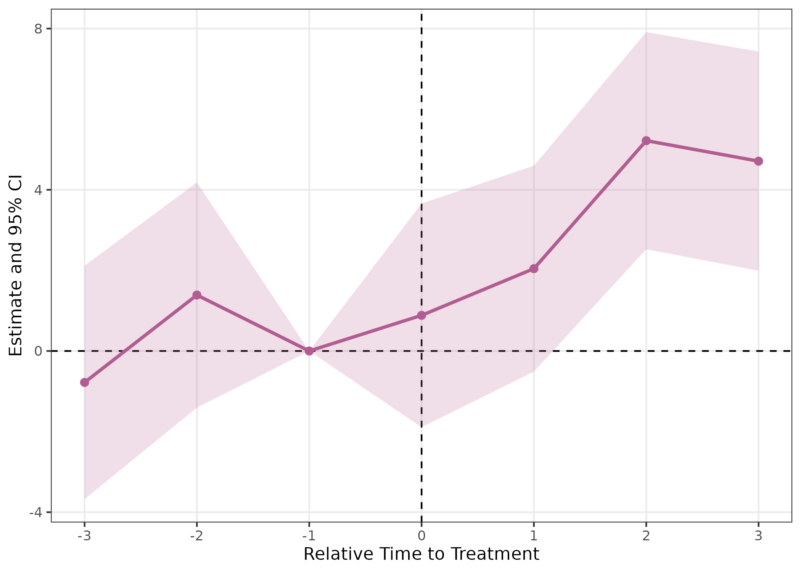
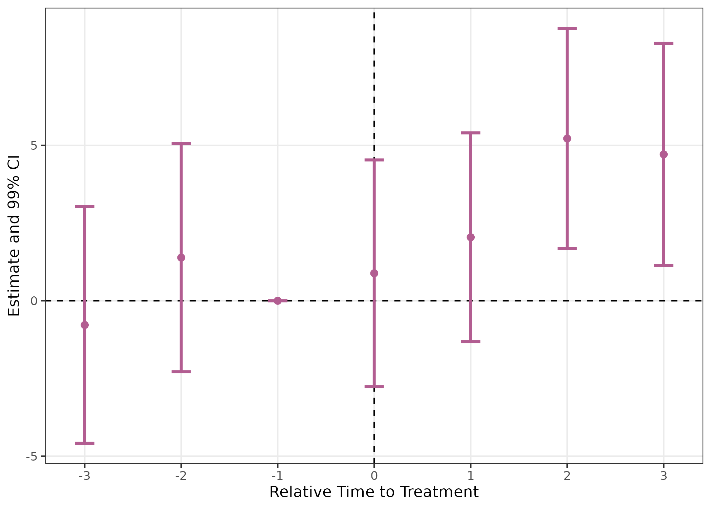
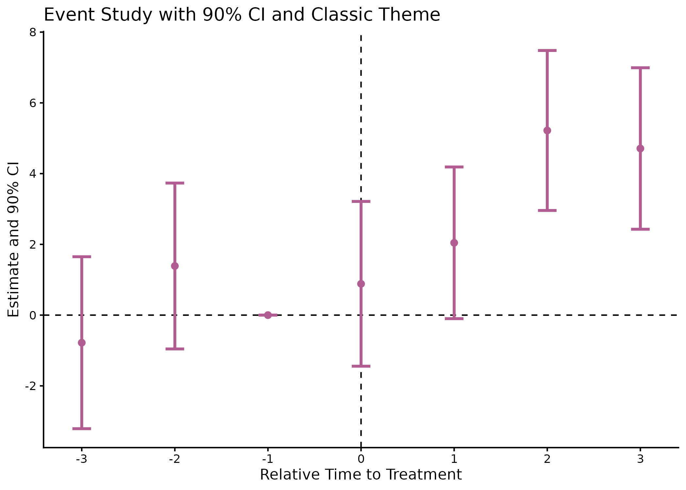
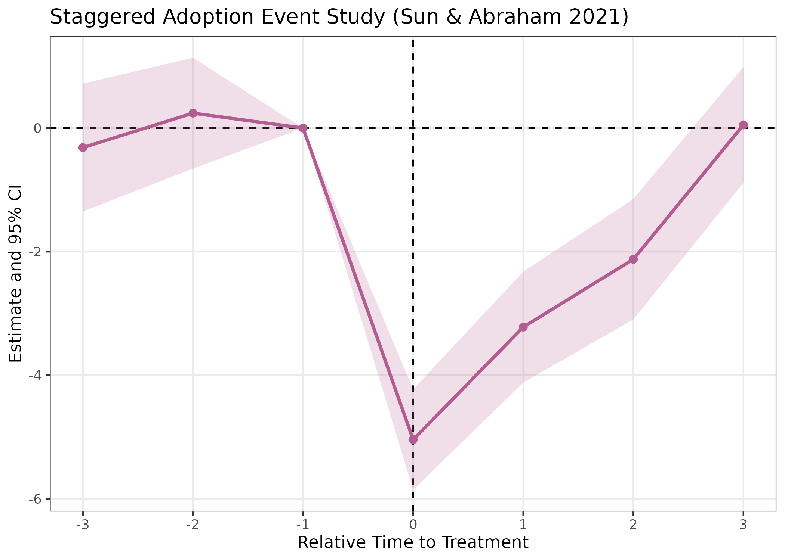
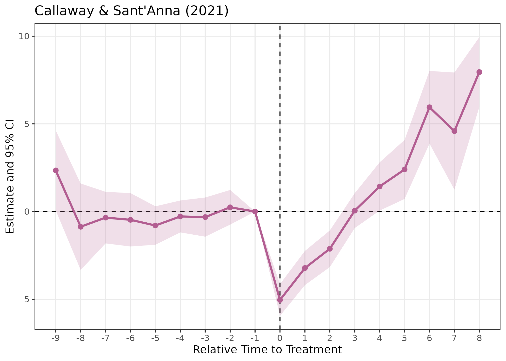
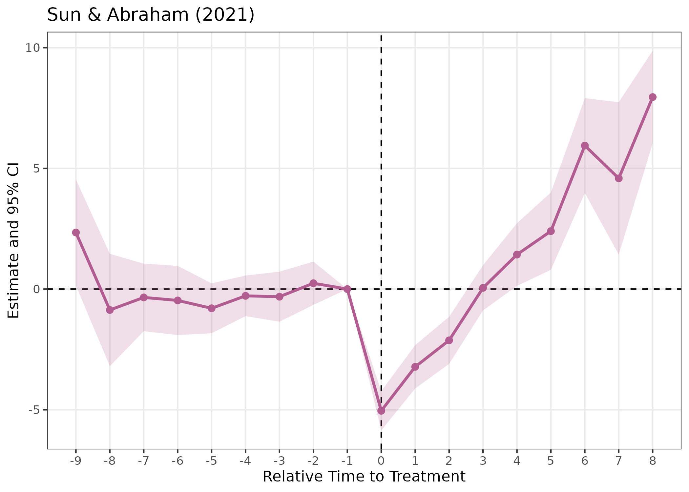
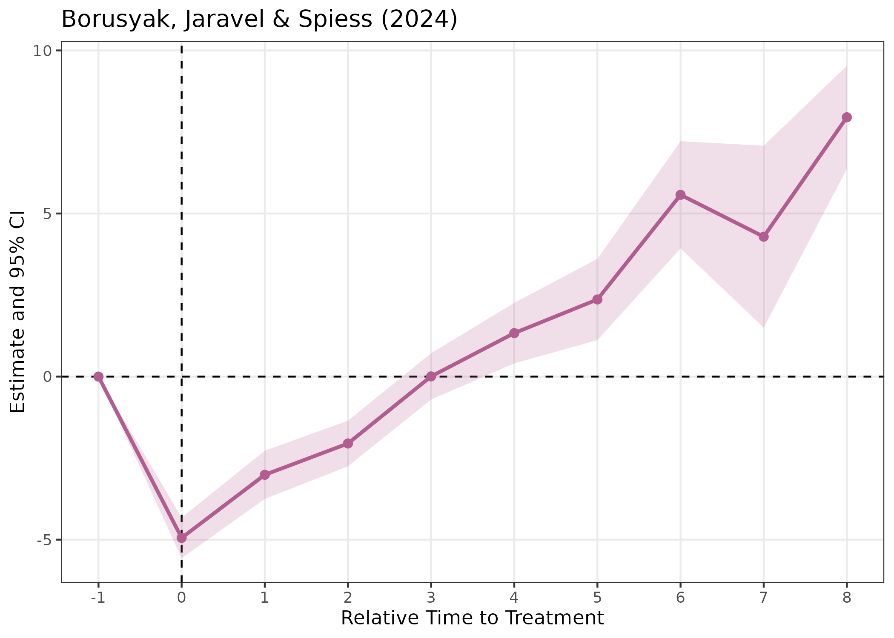
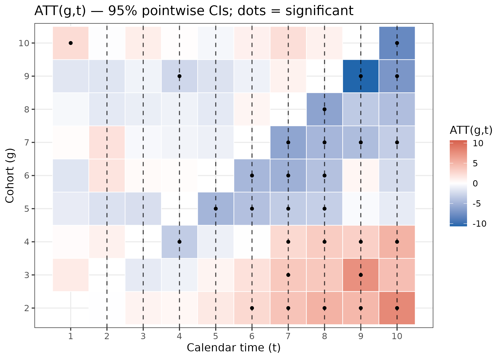
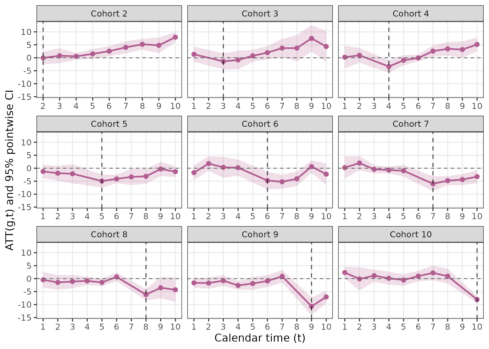

# Introduction to fixes

## Introduction

The **fixes** package provides an easy-to-use toolkit for creating,
estimating, and visualizing event study models using fixed effects
regression. With **fixes**, you can automatically generate lead and lag
dummy variables, flexibly estimate fixed effects event study
regressions, and visualize the results with `ggplot2` using a single
pipeline.

This vignette introduces the core functions of the package through
simple examples, including recent updates such as multiple confidence
interval support and improved plotting options.

## Installation

Install the released version from CRAN:

``` r

install.packages("fixes")
```

Or with **pak** (recommended for fast install):

``` r

pak::pak("fixes")
```

To install the latest development version from GitHub:

``` r

pak::pak("yo5uke/fixes")
```

or

``` r

devtools::install_github("yo5uke/fixes")
```

## Minimal Example

Below is a basic example using the built-in
[`fixest::base_did`](https://lrberge.github.io/fixest/reference/base_did.html)
dataset, running an event study, and visualizing the results.

``` r

# Load example data
df <- fixest::base_did

# Run the event study (supports multiple confidence levels)
event_study <- run_es(
  data       = df,
  outcome    = y,
  treatment  = treat,
  time       = period,
  timing     = 5,  # Treatment occurs at period 5
  fe         = ~ id + period,
  cluster    = ~ id,
  baseline   = -1,
  interval   = 1,
  lead_range = 3,
  lag_range  = 3,
  conf.level = c(0.90, 0.95, 0.99)  # Multiple CIs supported!
)

# View results
head(event_study)
#> Event Study Result (fixes)
#>   N: 1080  | Units: NA  | Treated units: 1080  | Never-treated: NA 
#>   FE: id + period
#>   VCOV: cluster  | Cluster: id 
#>   Method: classic  | lead_range: 3  lag_range: 3  baseline: -1
```

## Visualizing Event Study Results

The **fixes** package provides
[`plot_es()`](https://yo5uke.com/fixes/reference/plot_es.md) for
flexible visualization. You can easily switch between ribbon-style or
error bar CIs, select the displayed CI level, and customize appearance.

``` r

# Basic plot (default: ribbon, 95% CI)
plot_es(event_study)
```



``` r

# Plot with error bars and 99% CI
plot_es(event_study, type = "errorbar", ci_level = 0.99)
```



``` r

# Customize further with ggplot2
plot_es(event_study, type = "errorbar", ci_level = 0.9, theme_style = "classic") +
  scale_x_continuous(breaks = seq(-3, 3, by = 1)) +
  ggtitle("Event Study with 90% CI and Classic Theme")
```



## Staggered Treatment with `sunab`

For staggered adoption designs where treatment timing varies across
units, you can use `method = "sunab"` to implement the Sun & Abraham
(2021) estimator, which is robust to heterogeneous treatment effects.

``` r

# Example with fixest::base_stagg data
df_stagg <- fixest::base_stagg

event_study_sunab <- run_es(
  data       = df_stagg,
  outcome    = y,
  treatment  = treated,
  time       = year,
  timing     = year_treated,
  fe         = ~ id + year,
  staggered  = TRUE,
  method     = "sunab",  # Use Sun & Abraham decomposition
  lead_range = 3,
  lag_range  = 3,
  cluster    = ~ id
)

head(event_study_sunab)
#> Event Study Result (fixes)
#>   N: 950  | Units: NA  | Treated units: 950  | Never-treated: NA 
#>   FE: id + year
#>   VCOV: cluster  | Cluster: id 
#>   Method: SUNAB (staggered-safe)
```

``` r

# Visualize sunab results
plot_es(event_study_sunab) +
  ggtitle("Staggered Adoption Event Study (Sun & Abraham 2021)")
```



**New in v0.7.1:** The `baseline` parameter now applies to both
`classic` and `sunab` methods, and the baseline period is included in
results with zero estimates for consistent visualization.

## Package Highlights

- **[`run_es()`](https://yo5uke.com/fixes/reference/run_es.md)**:
  - Fast, one-step event study for panel data.
  - Automatic creation of lead/lag dummies relative to treatment.
  - Supports both classic and staggered timing, covariates, clustering,
    weights, and flexible baseline normalization.
  - Choice of estimation methods: `classic` (factor expansion) or
    `sunab` (Sun & Abraham 2021 for staggered designs).
  - Multiple confidence interval levels supported (e.g., 90%, 95%, 99%).
  - Handles irregular time panels via `time_transform`.
  - Results are filtered to specified `lead_range` and `lag_range`
    (v0.7.1+).
- **[`plot_es()`](https://yo5uke.com/fixes/reference/plot_es.md)**:
  - Intuitive event study plot with ribbon or errorbar CI display.
  - CI level and visual style are fully customizable.
  - ggplot2-based for further modification.
- **[`plot_es_interactive()`](https://yo5uke.com/fixes/reference/plot_es_interactive.md)**
  (v0.7.0+):
  - Interactive plotly-based visualizations with hover tooltips.
  - Displays point estimates, confidence intervals, standard errors, and
    p-values on hover.

## Staggered adoption estimators (v0.8.0)

Standard TWFE event-study regressions can produce biased and
sign-reversed estimates under heterogeneous treatment effects when units
adopt treatment at different times (Callaway & Sant’Anna 2021; Sun &
Abraham 2021; Borusyak, Jaravel & Spiess 2024). **fixes** v0.8.0 adds
three robust alternatives, all accessible through the same
[`run_es()`](https://yo5uke.com/fixes/reference/run_es.md) interface via
the `estimator` argument.

We demonstrate all three on
[`fixest::base_stagg`](https://lrberge.github.io/fixest/reference/base_stagg.html),
a simulated staggered-adoption panel with true ATT = 1 for all cohorts
and horizons.

``` r

df_stagg <- fixest::base_stagg
# Mark never-treated units with NA (convention for all three estimators)
df_stagg$timing <- df_stagg$year_treated
df_stagg$timing[df_stagg$year_treated == 10000] <- NA
```

### Callaway & Sant’Anna (2021) — `estimator = "cs"`

Estimates a separate ATT(g,t) for every cohort-by-period cell, then
aggregates to an event-study curve using cohort-size weights.

``` r

res_cs <- run_es(
  data          = df_stagg,
  outcome       = y,
  time          = year,
  timing        = timing,
  unit          = id,
  staggered     = TRUE,
  estimator     = "cs",
  control_group = "nevertreated"
)
plot_es(res_cs) + ggplot2::ggtitle("Callaway & Sant'Anna (2021)")
```



### Sun & Abraham (2021) — `estimator = "sa"`

Builds cohort x relative-time interactions and aggregates with
cohort-share weights. Numerically identical to
[`fixest::sunab()`](https://lrberge.github.io/fixest/reference/sunab.html).

``` r

res_sa <- run_es(
  data      = df_stagg,
  outcome   = y,
  treatment = treated,
  time      = year,
  timing    = timing,
  unit      = id,
  fe        = ~ id + year,
  staggered = TRUE,
  estimator = "sa",
  cluster   = ~ id
)
plot_es(res_sa) + ggplot2::ggtitle("Sun & Abraham (2021)")
```



### Borusyak, Jaravel & Spiess (2024) — `estimator = "bjs"`

Fits TWFE on untreated observations, imputes counterfactuals for treated
units, then averages by horizon.

``` r

res_bjs <- run_es(
  data      = df_stagg,
  outcome   = y,
  time      = year,
  timing    = timing,
  unit      = id,
  staggered = TRUE,
  estimator = "bjs"
)
plot_es(res_bjs) + ggplot2::ggtitle("Borusyak, Jaravel & Spiess (2024)")
```



Under homogeneous treatment effects (as in this DGP), all three
estimators give similar results, each recovering a post-treatment ATT
close to the true value of 1.

------------------------------------------------------------------------

## Bootstrap simultaneous confidence bands (v0.8.0)

### Pointwise vs. simultaneous CIs

Standard confidence intervals are **pointwise**: the 95% CI at each
horizon covers the true value with 95% probability, but the probability
that *all* intervals simultaneously cover their true values can be much
lower when many periods are plotted.

**Simultaneous** confidence bands (Callaway & Sant’Anna 2021,
Corollary 1) control the joint coverage probability. With probability at
least 1 − α, the entire event-study curve is contained within the
simultaneous band. This is especially important for parallel-trends
pre-testing: a pre-trend test based on simultaneous bands controls the
family-wise error rate.

### Usage

Pass `bootstrap = TRUE` to
[`run_es()`](https://yo5uke.com/fixes/reference/run_es.md) together with
the CS estimator. The multiplier bootstrap (Algorithm 1 of Callaway &
Sant’Anna 2021) is used.

``` r

# NOTE: B = 199 shown here for brevity; use B = 999 in practice
res_cs_boot <- run_es(
  data          = df_stagg,
  outcome       = y,
  time          = year,
  timing        = timing,
  unit          = id,
  staggered     = TRUE,
  estimator     = "cs",
  control_group = "nevertreated",
  bootstrap     = TRUE,
  B             = 199,
  boot_seed     = 42
)
# The lighter outer band is the simultaneous CI; the darker inner band is
# the standard pointwise CI.
plot_es(res_cs_boot, show_simultaneous = TRUE)
```

The simultaneous critical value ĉ and per-period simultaneous CI bounds
are stored in `attr(res_cs_boot, "bootstrap")`. The simultaneous band is
always at least as wide as the pointwise band, since the critical value
ĉ\_{1-α} \>= z\_{1-α/2}.

------------------------------------------------------------------------

## ATT(g,t) visualization (v0.8.0)

The CS estimator produces a separate ATT estimate for every (cohort g,
calendar period t) pair.
[`plot_att_gt()`](https://yo5uke.com/fixes/reference/plot_att_gt.md)
visualises this full matrix.

### Heatmap

Tiles are filled by the ATT(g,t) estimate. Cells whose pointwise CI
excludes zero are marked with a filled dot (●); when bootstrap data are
available, simultaneously significant cells also receive an open diamond
(◇).

``` r

plot_att_gt(res_cs, type = "heatmap")
```



The vertical dashed lines mark each cohort’s treatment onset (t = g).

### Facet plot

One panel per cohort showing ATT over calendar time, with a pointwise CI
ribbon. Useful for inspecting heterogeneous dynamics across cohorts.

``` r

plot_att_gt(res_cs, type = "facet")
```



------------------------------------------------------------------------

## Conclusion

The **fixes** package streamlines event study estimation and
visualization for panel data researchers. With a minimal API, multiple
CI support, and robust visualization, it accelerates the workflow for
dynamic treatment effect analysis.

For further details and full argument documentation, see:

``` r

?run_es
?plot_es
?plot_att_gt
```

Happy analyzing!
